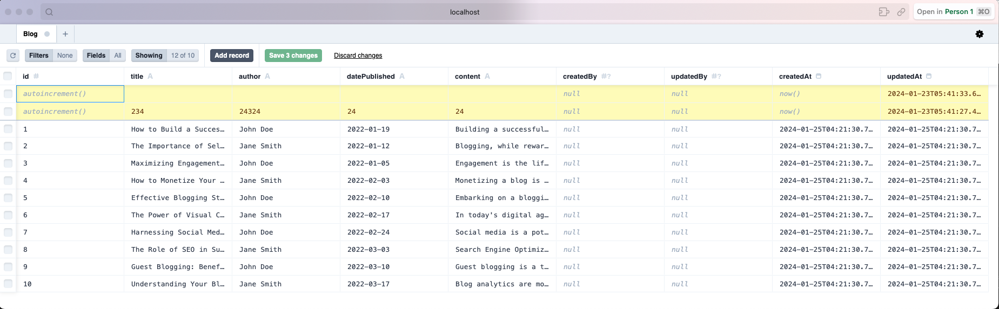
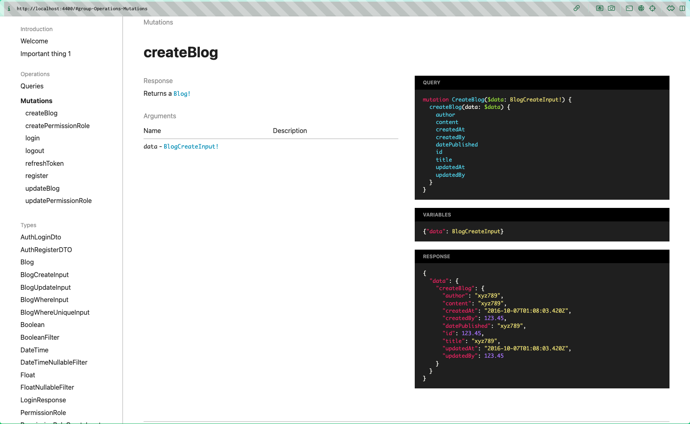
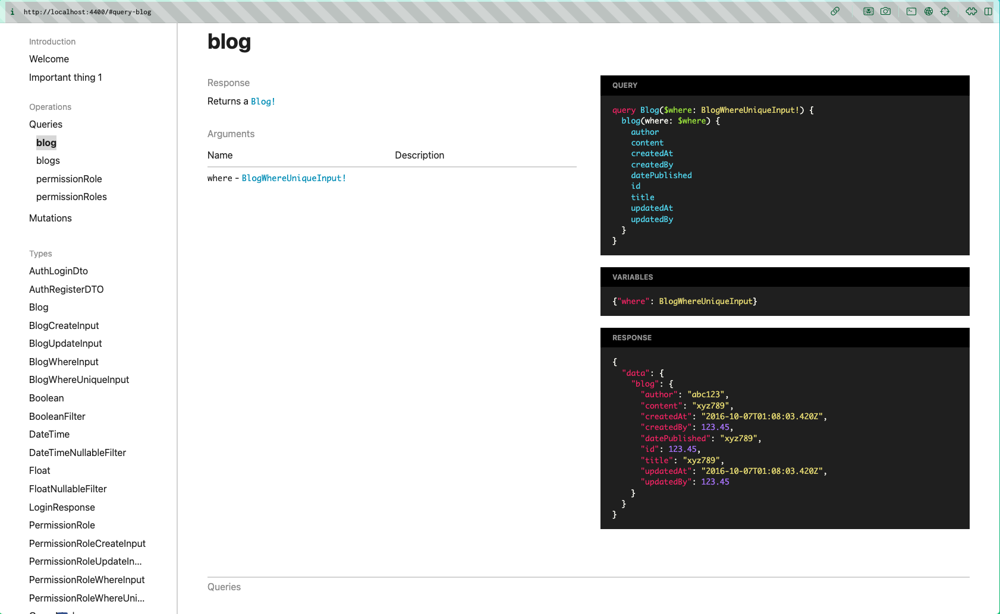
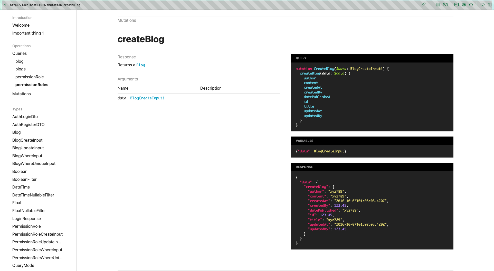

<p align="center">
  <a href="http://nestjs.com/" target="blank"></a>
</p>

[circleci-image]: https://img.shields.io/circleci/build/github/nestjs/nest/master?token=abc123def456
[circleci-url]: https://circleci.com/gh/nestjs/nest

  <p align="center">A progressive <a href="http://nodejs.org" target="_blank">Node.js</a> framework for building efficient and scalable server-side applications.</p>
    <p align="center">
<a href="https://www.npmjs.com/~nestjscore" target="_blank"></a>
<a href="https://www.npmjs.com/~nestjscore" target="_blank"></a>
<a href="https://www.npmjs.com/~nestjscore" target="_blank"></a>
<a href="https://circleci.com/gh/nestjs/nest" target="_blank"></a>
<a href="https://coveralls.io/github/nestjs/nest?branch=master" target="_blank"></a>
<a href="https://discord.gg/G7Qnnhy" target="_blank"></a>
<a href="https://opencollective.com/nest#backer" target="_blank"></a>
<a href="https://opencollective.com/nest#sponsor" target="_blank"></a>
  <a href="https://paypal.me/kamilmysliwiec" target="_blank"></a>
    <a href="https://opencollective.com/nest#sponsor"  target="_blank"></a>
  <a href="https://twitter.com/nestframework" target="_blank"></a>
</p>
  <!--[](https://opencollective.com/nest#backer)
  [](https://opencollective.com/nest#sponsor)-->

---

**Table of contents**

<details>
<summary>Click here to expand</summary>

- [NestJS - GraphQL - Prisma](#nestjs---graphql---prisma)
  - [Features](#features)
  - [Prerequisites](#prerequisites)
  - [Getting started](#getting-started)
    - [Installation](#installation)
    - [Command lines](#command-lines)
  - [Docker](#docker)
    - [Command line](#command-line)
  - [Thanks](#thanks)
  
</details>

## Features

I create this repo for learning, practicing and understanding how to work NestJS, GraphQL & Prisma together. Project also how to build a clean architecture scalable & testable.

Features of project:

- GraphQL with [apollo-server-express](https://github.com/apollographql/apollo-server), solution [code first](https://docs.nestjs.com/graphql/quick-start#code-first) and using [GraphQL play ground](https://github.com/graphql/graphql-playground)
- Using [PostgreQL](https://github.com/brianc/node-postgres) for database and [Prisma 2](https://github.com/prisma/prisma) as ORM
- CRUD operations, database relationship, pagination
- [NestJS Authentication](https://docs.nestjs.com/security/authentication) with ~~JWT~~
- Refresh token solution
- Role base system: Admin & User
- Database seeding
- Rating limit API with [express-rate-limit](https://github.com/nfriedly/express-rate-limit)
- Using custom exceptions filter, custom decorators
- Docker solution for PostgreSQL, Prisma
- Solve N+1 problem graphql (using [@paljs/plugin](https://github.com/paljs/prisma-tools/blob/master/packages/plugins/README.md))

## Prerequisites

If you want to develop project only on your local, your need have:
- [NodeJS](https://nodejs.org/en/download/): I use NodeJS lts version (14.15.1)
- npm or yarn: [yarn](https://classic.yarnpkg.com/en/docs/install/#debian-stable) recommend
- [@prisma/cli](https://www.prisma.io/docs/concepts/components/prisma-cli/installation)
- [PostgreSQL](https://www.postgresql.org/download/)

## Getting started

### Installation

- Clone project from this repository
- Create and update `.env` file for variables environment
  ```bash
  $ cp .env
  ```

  Then modify the variables as you want.

  Example of `.env` files:
  ```env
  DB_CONNECTOR=postgres
  DB_HOST=localhost
  DB_USER=postgres
  DB_PASSWORD=anhtaidang
  DB_DATABASE=cloudverse
  DB_PORT=5432
  REFRESH_TOKEN_SECRET="mysecret"
  ACCESS_TOKEN_SECRET="mysecret"
  APP_URL=http://localhost:3000
  IMAGE_PATH=/images


  DATABASE_URL=postgresql://${DB_USER}:${DB_PASSWORD}@${DB_HOST}:${DB_PORT}/${DB_DATABASE}?schema=public
  ```

- Install dependencies
  ```bash
  $ npm install
  # or yarn install
  ```
- Generate prisma schema
  Make sure you generate prisma schema before run server:
  ```bash
  $ npx prisma generate
  ```

  Check [Prisma Client](https://www.prisma.io/docs/concepts/components/prisma-client) for more details how `prisma generate works`

- Run server locally
  ```bash
  $ npm run start:dev
  # or yarn start:dev
  ```

### Command lines

Other useful commands to work with project:
- Run production
  ```ts
  $ npm run start:prod
  ```
- Run testing:
  ```bash
  $ npm run test # for running the the Unit $ integration testing
  $ npm run test:e2e  # for running end to end testing
  ```
- Prisma migrate
  [Prisma migrate](https://www.prisma.io/docs/concepts/components/prisma-migrate) is an imperative database schema migration tool that enables you to make changes to your database schema.

  Migrate auto your schema:
  ```bash
  $ npx prisma migrate dev --preview-feature
  ```

  Migrate with the name schema:
  ```bash
  $ npx prisma migrate dev --name initDb --preview-feature
  ```

  When we run `prisma generate` or `prisma migrate`, `prisma/cli` will try connect with your database first. So you need to connect successfully with your database through your variable `DATABASE_URL` given in `prisma.schema`:

  For example, you have configuration in your `prisma.schema` like below:

  ```prisma
  // prisma.schema
  datasource db {
    provider = "postgresql"
    url      = env("DATABASE_URL")
  }
  ```

  So you need to provide this value in `.env` file:

  ```
  DB_HOST=postgres
  DB_USER=postgres
  DB_PASSWORD=postgres
  DB_DATABASE=nest_graphql
  DB_PORT=5432
  DATABASE_URL="postgresql://${DB_USER}:${DB_PASSWORD}@${DB_HOST}:${DB_PORT}/${DB_DATABASE}?schema=public"

  ```

  Check more information at [Prisma migrate](https://www.prisma.io/docs/concepts/components/prisma-migrate)


- Seeding database(optional)
  If you have any errors, so you can try running command below to sync your database:

  ```bash
  $ npx prisma db push
  ```
  Then you can run seeding database:

  ```bash
  $ npm run seed
  ```
  
  When you run seeding database done. You can use Prisma studio for checking your database. If you see Movie table has empty.
  Don't worry, when you run server, the server will run seeding database automatically by cron.

  
- Prisma studio

  A Visual Interface for Your Database
  [Prisma Studio](https://www.prisma.io/blog/prisma-studio-3rtf78dg99fe) helps developers manage their application data. We're excited to share that it is now part of the stable Prisma release. Try out the [online demo](https://prisma.studio/) or connect it to your existing database.

  So with Prisma studio, you maybe don't need **pgAdmin** anymore.
  <div align="center">
    
  </div>

  Ton run Prisma studio:
  ```bash
  $ npx prisma:studio
  # or npm run prisma studio
  # or yarn prisma studio
  ```
  Then check out at http://localhost:5555
- 
### Documentation
You need to run the code below to generate the documentation:

  ```bash
  $ npm run document
  # or npx document
  # or yarn document
  ```

You can check out the documentation of project at http://localhost:4400

  <div align="center">
    
  </div>

  <div align="center">
    
  </div>

  <div align="center">
    
  </div>

---
## Docker
To start working with **Docker**, you need have [Docker](https://docs.docker.com/engine/install/) installed locally and also the package manage as **npm** ro **yarn**

In the **development** mode, we have already **PostgreSQL** in our `docker-compose` file. You can use the same values environment in your `.env` like before.

### Command line
```bash
$ docker-compose build # Build all services in docker-compose.yml file
$ docker-compose up # Run all services in docker-compose.yml
$ docker-compose down # Stop all services
```

## Thanks
